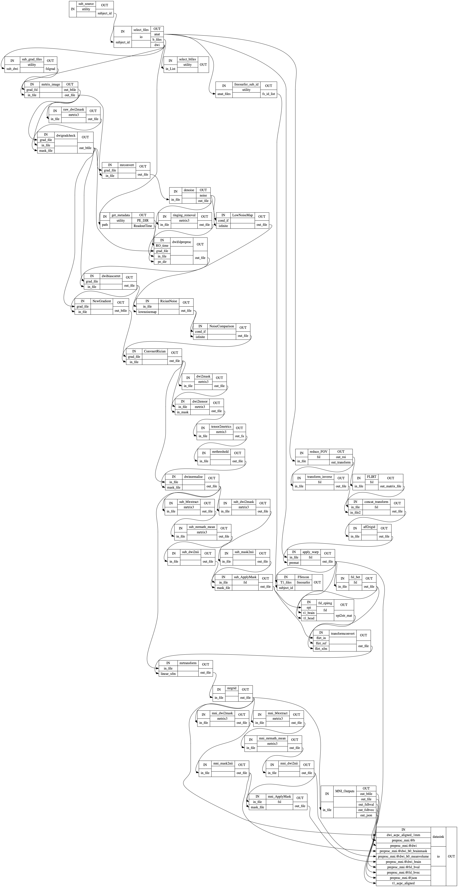

# Pipetography
> Nipype and mrtrix3 based pre-/post- processing pipeline for brain diffusion-MRI and generation of structural connectomes of the brain.


This repo currently only has pre-processing capabilities! More will be added in the near future.

The pre-processing workflow has been updated to reflect what's seen in the optimal [DESIGNER pipeline](http://www.sciencedirect.com/science/article/pii/S1053811918306827) and on [mrtrix3 cloud apps on brainlife.io](https://brainlife.io). 

## Install

Since most usages will be on HPC resources, I <em>highly recommend</em> that you use the `Singularity` or `Docker` recipe in the repository instead of installing the Python module.

#### Singularity (recommended):

 - To build sandbox singularity image: `singularity build -s pipetography.simg singularity.def`

 - Run singularity image with: `singularity run -B <BIDS_DIR>:<Singularity_BIDS_DIR> pipetography.simg` (You will have to bind your data directories in addition to just `singularity run`)
 
#### Docker:

 - Pull the docker image: `docker pull axiezai/pipetography`
 
 - Run with BIDS directory and interactive bash terminal: `docker run -v <BIDS_DIR>:<Docker_BIDS_DIR> -it axiezai/pipetography bash`

Known container issues:
 - The freesurfer `license.txt` file, although copied into the containers and the environment variable `FS_LICENSE` is set, must be moved into the freesurfer home folder before running the pipeline. So once your image is built, run it interactively and manually move the license file with `mv /license.txt /opt/freesurfer-6.0.0-min/` **Added a move license command in container recipe files'
 
 - Singularity image missing freesurfer path to `nu_correct` as part of `$PATH`. 

 - If `singularity build` fails with `apt-get install` error complaining about unauthenticated packages, add `--allow-unauthenticated` to every `apt-get` line in the `sinngularity.def` file.
 
 - Containers missing standard libraries like `libopenblas` or `libfortran`, this is because `$LS_LIBRARY_PATH` is missing conda environment's lib path. We need to append the environment's lib path with `export LB_LIBRARY_PATH=$LD_LIBRARY_PATH:/opt/miniconda-latest/envs/tracts/lib/`. **The conda env path has been appended as part of the container recipe file**
 
 - [Freesurfer6.0.0-min `recon-all` is missing commands if `-parallel` or `-openmp` are set to `True`](https://github.com/ReproNim/neurodocker/issues/285). The default `-parallel` **setting has been set to False for `pipetography.pipeline`**.
 
#### Creating your own environment and install `pipetography` as a Python module:

`pip install pipetography`

Since `pipetography` is a `Nipype` wrapper around `mrtrix3`, `ANTs`, and `FSL`, you have to follow their installation instructions and set them up appropriately on your machine as well:    
 - [mrtrix3 v3.0.0](https://mrtrix.readthedocs.io/en/latest/installation/before_install.html)
 
 - [ANTs](https://github.com/ANTsX/ANTs/wiki/Compiling-ANTs-on-Linux-and-Mac-OS)
     
 - [FSL](https://fsl.fmrib.ox.ac.uk/fsl/fslwiki/FslInstallation)
 
 - [Freesurfer v6.0](https://surfer.nmr.mgh.harvard.edu/fswiki/DownloadAndInstall)
 
 - [Matlab Run Time Compiler for freesurfer](https://surfer.nmr.mgh.harvard.edu/fswiki/MatlabRuntime)
 

## The pipeline:

The following pipeline is produced by running the default set up in [pipeline](https://axiezai.github.io/pipetography/pipeline/). And each individual node in the workflow is shown in [core](https://axiezai.github.io/pipetography/core/).

```
#example
from IPython.display import Image
Image('docs/images/output_5_0.png')
```





